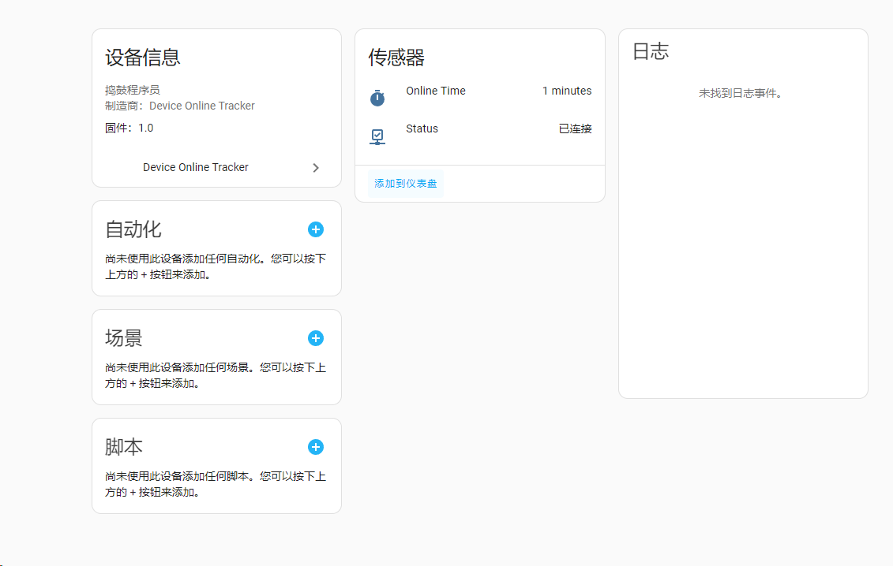

这是一个home assistant设备在线检测插件，统计每日在线时长及在线状态。

# 教程
基本使用 https://www.bilibili.com/video/BV1vHoTYcE85

# 安装
## 方法一：
1. 首先确保已安装HACS
2. 在HACS中添加自定义仓库https://github.com/qq273681448/ha-DeviceOnlineTracker
3. 搜索"Device Online Tracker"并安装
4. 刷新页面
## 方法二（暂不可用）

# 预览
